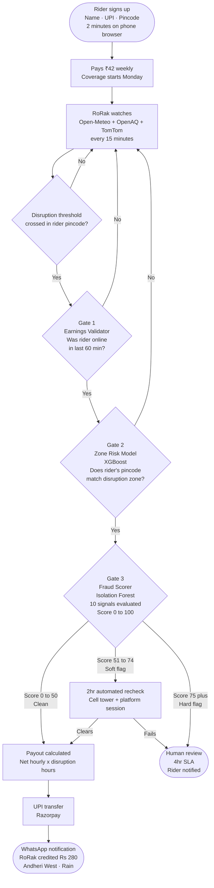
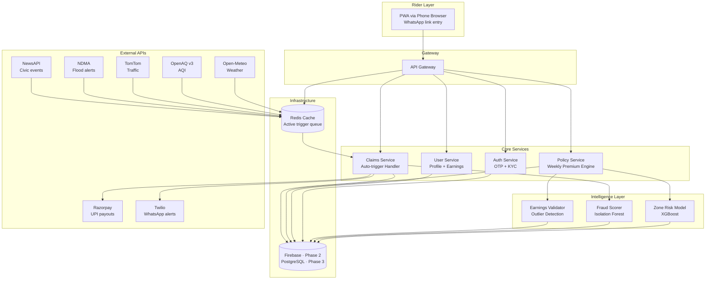
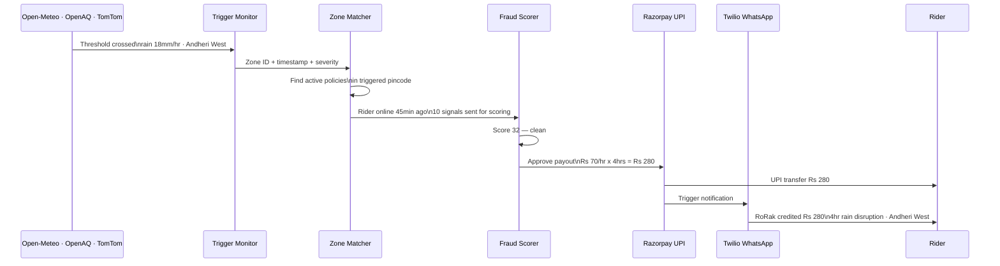
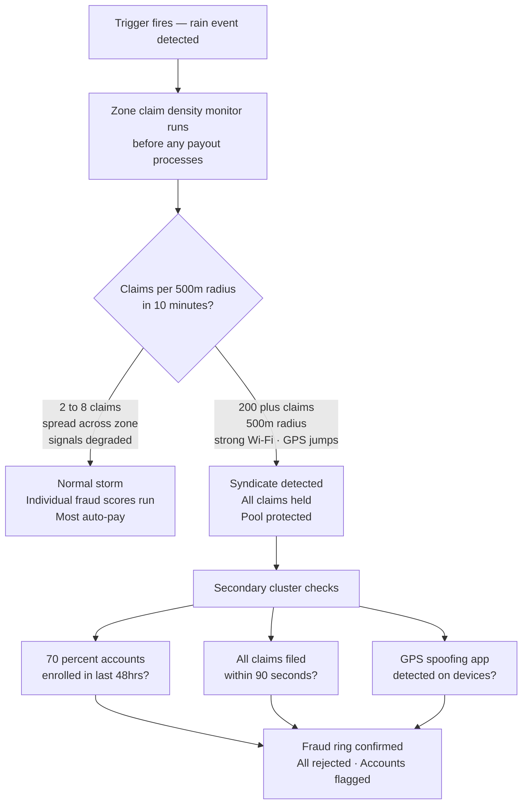
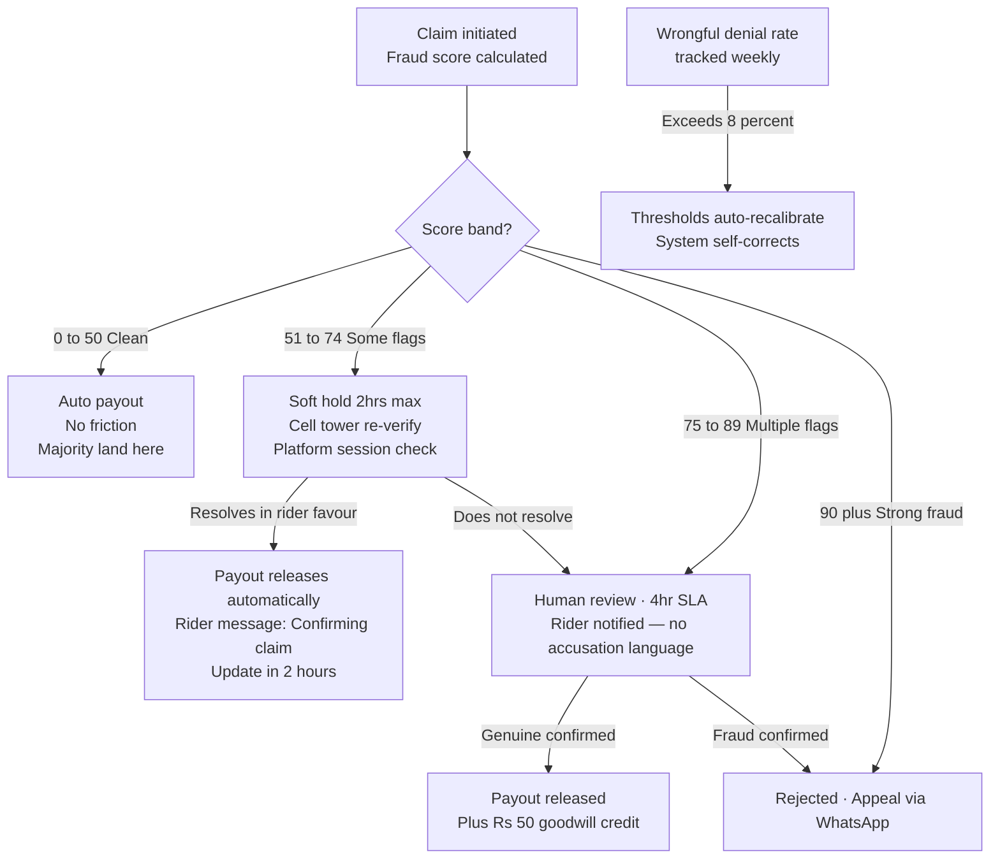

# RoRak — Income Protection for Q-Commerce Delivery Riders

> **RoRak** is short for *RoziRaksha*   
> *"Teri rozi ki Raksha, hamesha."*
> 
> *Under Parametric Insurtech*

---

## Team

| Name | Role |
|------|------|
| Mansi Jangid    | Strategy, Research, Product Design |
| Shivam Vishwakarma  | Development                        |
| Shivangi Sahu   | UI/UX Design                       |

**Solution:** RoziRaksha  
**Repository:** github.com/Mansi29j/devtrails_2026  
**Persona:** Q-Commerce Delivery Riders — Blinkit / Zepto   

---

## 1. The Problem

Q-Commerce riders (Blinkit, Zepto) earn entirely based on orders completed.
When external disruptions hit their zone — heavy rain, dangerous air quality,
waterlogging, or civic shutdowns — deliverable orders drop sharply or stop
completely. Riders who are active and available to work earn nothing during
these periods, through no fault of their own.

**There is currently no income protection for this segment.**
When a disruption occurs, the rider absorbs the full financial loss.

### 1.1 Persona : Aryan(Gig Worker)

| Earning | Amount |
|---|---|
| Gross daily | ₹1,000 |
| Fuel + platform commission | − ₹300 |
| **Net daily** | **₹700** |
| **Net weekly** | **₹4,200** |
| Disruption days/year | 15–18 *(IMD Mumbai historical data)* |
| **Annual unprotected loss** | **₹10,500 – ₹12,600** |
 
> Payout based on net income only. Fuel and platform commission deducted to reflect real take-home.
> Vehicle repair and maintenance excluded — not covered, not calculated.
 
### Pain Points
 
| Problem | Reality |
|---|---|
| Platform stops first | Blinkit pauses dispatch — Aryan earns ₹0, no say |
| No buffer | One disruption day = ₹700 gone. Weekly cash cycle breaks. |
| No product exists | Every insurance covers health or vehicle — not lost income |


---

## 2. The Solution — RoRak

RoRak is a **parametric income insurance platform** for Q-Commerce delivery riders.

**What this means in simple terms:**
A pre-agreed external event (heavy rain, dangerous AQI) is detected automatically
by a weather or environment API. If the rider was active and in the affected zone,
their estimated lost income is transferred to their UPI — no claim form, no call,
no paperwork required from the rider.

**Coverage:** Income lost during verified external disruption events only.  
**Excluded:** Health, life, accidents, vehicle damage, vehicle repair — strictly.

### 2.1 Real Scenarios Faced by Aryan
 
### Scenario 1 — Heavy Rain 
 
| | |
|---|---|
| **Event** | Rainfall >15mm/hr · Andheri West |
| **Platform action** | Blinkit pauses all dispatches from dark store |
| **Income lost** | 4 hrs × ₹70 = ₹280 |
| **RoRak** | Open-Meteo detects threshold · activity check passes · payout triggered |
| **Payout** | ₹280 → Aryan's UPI. He did nothing. |
 
### Scenario 2 — Dangerous AQI 
 
| | |
|---|---|
| **Event** | AQI >300 · Delhi NCR |
| **Platform action** | Zepto reduces zone availability |
| **Income lost** | 5 hrs × ₹70 = ₹350 |
| **RoRak** | OpenAQ detects threshold · rider was active · payout triggered |
| **Payout** | ₹350 → UPI. Automatic. |
 
### Scenario 3 — Waterlogging 
 
| | |
|---|---|
| **Event** | NDMA flood alert · rider's pincode |
| **Platform action** | Dark store suspends ops · roads impassable |
| **Income lost** | 6 hrs × ₹70 = ₹420 |
| **RoRak** | NDMA alert confirmed · rider was online · payout triggered |
| **Payout** | ₹420 → UPI. Before rider checks his phone. |
 
### Scenario 4 — Extreme Heat 
 
| | |
|---|---|
| **Event** | >42°C + state heat advisory issued |
| **Platform action** | Blinkit cuts delivery slots *(precedent: Delhi, May 2024)* |
| **Income lost** | 3 hrs × ₹70 = ₹210 |
| **RoRak** | Open-Meteo + IMD advisory confirmed · rider active · payout triggered |
| **Payout** | ₹210 → UPI. Automatic. |
 
### Scenario 5 — Civic Shutdown 
 
| | |
|---|---|
| **Event** | Declared bandh · city zone · roads blocked |
| **Platform action** | Platform suspends operations in affected zone |
| **Income lost** | Up to full day = ₹700 |
| **RoRak** | NewsAPI keyword detection · ops team manually confirms · approved |
| **Payout** | Capped at 8hr max → UPI. Human confirmed before release. |
 


---

## 3. Disruption Triggers
 
No rider input triggers a payout. Only verified external data does.
 
| # | Trigger | Threshold | API | Cost |
|---|---|---|---|---|
| 1 | Heavy Rainfall | >15mm/hr for 20+ min | Open-Meteo | Free, no key, no limit |
| 2 | Extreme Heat | >42°C + state advisory | Open-Meteo + IMD RSS | Free |
| 3 | Dangerous AQI | AQI >300 (CPCB: Very Poor) | OpenAQ v3 | Free, open source |
| 4 | Waterlogging / Flood | Alert for rider's pincode | NDMA public API | Free govt source |
| 5 | Civic Shutdown | Curfew / bandh declared | NewsAPI + Admin trigger | Free tier, 100 calls/day |
 
> **TomTom Traffic API** used as corroborating signal.
> Rainfall detected AND roads at near-zero speed = two independent sources confirming.
> Harder to fake than one signal alone.
 


---
## 4. Weekly Premium Model

 Premium is what the rider pays weekly to stay covered. **Set at ~1%** of their net weekly income — low enough to fund real payouts when disruptions hit.

### How the Premium is Calculated
 
```
Step 1 — Net weekly income
         ₹700/day × 6 days = ₹4,200
 
Step 2 — Base rate
         ₹4,200 × 1% = ₹42
 
Step 3 — Zone risk multiplier
         Standard zone    × 1.0  = ₹42
         Mumbai coastal   × 1.15 = ₹49
         Chennai cyclone  × 1.3  = ₹55
         Pune Tier-2      × 0.85 = ₹36
```
 
### Premium Tiers
 
| Rider Zone | Net Weekly | Multiplier | Premium/Week |
|---|---|---|---|
| Pune · Tier-2 · low risk | ₹2,940 | 0.85× | ₹25 |
| Delhi · standard | ₹4,200 | 1.0× | ₹42 |
| Bangalore · standard | ₹4,200 | 1.0× | ₹42 |
| Mumbai · coastal | ₹4,200 | 1.15× | ₹49 |
| Chennai · cyclone zone | ₹4,200 | 1.3× | ₹55 |
 
### How the Payout is Calculated
 
Payout is based on **net income lost** — not gross.
 
```
Net hourly rate = (₹1,000 gross − ₹300 fuel + platform commission) ÷ 10 hrs
               = ₹70 per hour net
 
4-hour rain disruption payout = ₹70 × 4 = ₹280
6-hour flood disruption payout = ₹70 × 6 = ₹420
```
### Claim Rules
 
| Rule | Limit | Why |
|---|---|---|
| Max events/week | 3 | IMD: peak monsoon rarely exceeds 3 threshold events/week |
| Max duration/event | 8 hrs | Platforms resume in 4–6hrs. 8hr = safe buffer |
| Min gap between claims | 4 hrs | Within 4hrs = same storm. Blocks claim-splitting |
| Weekly payout cap | ₹1,200 / ₹2,000 | Protects liquidity pool |
| Min activity to claim | 20hrs online in prior week | Blocks same-day signup and claim |
 
---
## 5. AI and ML
 
| What Models | How | Tool |
|---|---|---|
| Zone risk scoring | Historical IMD + CPCB pincode data → risk multiplier for premium | XGBoost — trained on 10yr public data |
| Earnings validation | Flags stated income >1.8 SD above zone median at signup | Statistical outlier detection |
| Live trigger monitoring | APIs polled every 10–15 min — threshold crossed → payout sequence begins | Open-Meteo · OpenAQ · NDMA |
| Fraud scoring | 10 signals scored at claim time → score 0–100 → decision band | Isolation Forest model |
 

---

## 6. Tech Stack
 
| Layer | Tool | Why |
|---|---|---|
| Frontend | React.js PWA | Works on any phone browser — no install needed |
| Backend | Node.js + Express | Lightweight, async, handles API polling cleanly |
| Database | Firebase (Phase 2) → PostgreSQL (Phase 3) | Fast to build now, proper audit trail later |
| Weather | Open-Meteo | Free, no key, no rate limit — replaces OpenWeatherMap |
| Air Quality | OpenAQ v3 | Free, open source, all Indian cities |
| Traffic | TomTom free tier | Corroborates triggers — 2,500 calls/day free |
| Civic alerts | NewsAPI + Admin trigger | Keyword monitoring for curfew/bandh |
| Payments | Razorpay test mode | UPI simulation, India-native |
| Notifications | Twilio WhatsApp sandbox | Free, no approval needed for Phase 2 |
| Hosting | Vercel + Railway | Both free tiers |
 
---


## 7. Workflows
 
### 7.1 Rider Journey — PWA Flow

 
### The Score Bands :
 
Gate 3 outputs a fraud score 0–100. The score decides what happens next
 
| Score | What it means | What happens |
|---|---|---|
| 0–50   | All 10 signals consistent with genuine disruption | Auto payout via Razorpay |
|51–74  | Some signals need a second look | 2hr automated recheck — cell tower + platform session re-verified. Pays if clear. |
|75+    | Multiple signals inconsistent | Human review — 4hr SLA. Rider notified. Payout if genuine confirmed. |
 
---
 
RoRak is a **Progressive Web App**. Aryan opens it from a WhatsApp link in Chrome. Nothing to install.

 
### 7.2 System Architecture
 

 
### 7.3 Trigger to Payout Sequence
 

 
---
 
## 8. Adversarial Defense & Anti-Spoofing Strategy
 
> **The Crisis:** 500 riders. One Telegram group. One free GPS spoofing app.
> Fake coordinates placed inside a verified storm zone. Every claim passes basic GPS check.
> Liquidity pool drained in hours.
> **Simple GPS verification is dead. RoRak's response follows.**
 
### How We Tell a Genuine Rider from a Faker
 
GPS is only one of ten signals — and it is the one a spoofer controls. A genuine rider's story is consistent across every system. A spoofer fakes GPS. They cannot fake everything else.
 
| Signal | Genuine Rider | Spoofer at Home |
|---|---|---|
| GPS location | Inside zone — arrived naturally | Inside zone — instant jump |
| GPS trail (30 min) | Natural movement path | No prior trail — teleportation |
| Cell tower ID | Tower physically in zone | Tower in home neighbourhood |
| Network signal | Weak, fluctuating — storm congestion | Strong, stable — home Wi-Fi |
| Wi-Fi SSID | None — field environment | Home network detected |
| Accelerometer | Outdoor micro-movement | Flat, still — couch pattern |
| Barometric pressure | Drops — storm front | Normal indoor pressure |
| Platform session | Active — trying to get orders | Inactive or just opened |
| Last delivery | Within 2 hours | Hours ago — no work context |
| TomTom traffic | Roads at standstill | Roads normal near tower |
 
### What Data Catches a Fraud Ring
 
A single spoofer is hard to catch perfectly. 500 coordinating simultaneously are easy — coordination leaves a population-level pattern no individual signal shows.
 

 
| Signal | Normal Storm | Syndicate |
|---|---|---|
| Claims per 500m per 10 min | 2–8, spread across zone | 200+, tight cluster |
| Account age | Mixed tenures | 70%+ enrolled last 48hrs |
| Claim timing | 3–8 min after trigger | Under 90 seconds |
| Network signal | Weak — storm degraded | Strong — home Wi-Fi |
 
### How We Protect Genuine Riders from False Flags
 

 
**Three protections for genuine riders:**
 
- **Threshold relaxation** — IMD red alert confirmed by 2+ sources → fraud score threshold drops 15 points. Degraded signals are expected in real catastrophes.
- **Zone-population calibration** — 200 riders across 3km with weak signal = storm. 200 in 500m with strong Wi-Fi = syndicate. Individual claims scored in zone context, not isolation.
- **Soft-hold default** — flagged ≠ rejected. 2-hour automated check first. Most genuine edge cases clear without human involvement.
 
---
 

## 9. Sources
 
| Source | Used For |
|---|---|
| alphareach.tech | Rider pay structure — base pay, incentives |
| bitveen.com | Net earnings after expenses |
| NDTV rider interviews | Real daily earnings range |
| Zomato Investor Report Q3 2024 | Blinkit dark store count |
| IMD Open Data Portal | Historical pincode-level rainfall |
| CPCB Annual Reports | AQI zone frequency data |
| NDMA Portal | Flood zone classification |
| BMC Open Data Portal | Mumbai ward waterlogging data |
| The Hindu, May 2024 | Blinkit suspension during Delhi heatwave |
| Open-Meteo Docs | Free tier — no key, no rate limit |
| OpenAQ v3 Docs | Indian city coverage |
| TomTom Developer Docs | Traffic API — 2,500 free calls/day |
| NewsAPI Docs | Keyword search — 100 free calls/day |
 
---
*RoRak — RoziRaksha · Guidewire DEVTrails 2026*
